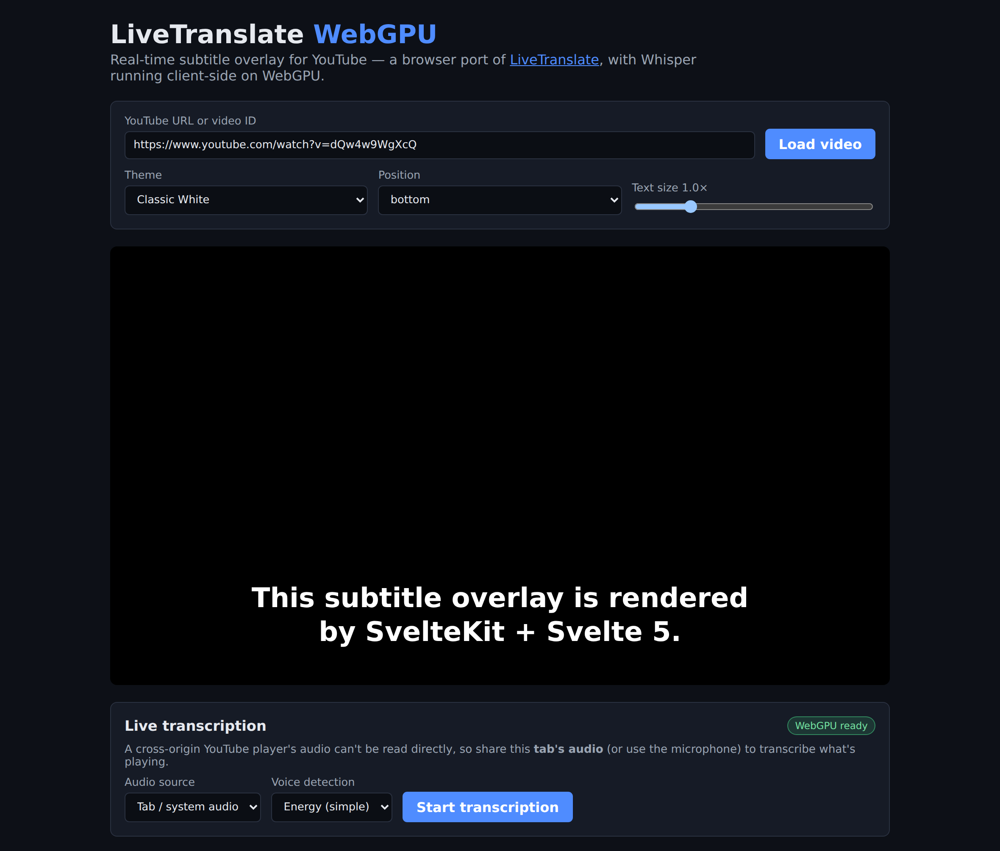

# LiveTranslate WebGPU

A browser-native port of [**LiveTranslate**](https://github.com/TheDeathDragon/LiveTranslate)
(a Windows/PyQt6 real-time audio translator) to **SvelteKit + Svelte 5**, running
**Whisper speech recognition entirely client-side on WebGPU** via
[transformers.js](https://huggingface.co/docs/transformers.js) / ONNX Runtime Web.

It overlays live subtitles on top of embedded **YouTube** videos — the same
"port a PyTorch model to the browser with WebGPU" approach Simon Willison used in
[Porting the Moebius model](https://simonwillison.net/2026/Jun/22/porting-moebius/).

<!-- Generated by `npm run screenshot` — regenerate and commit after any visual UI change. -->



## Pipeline

The original desktop pipeline is reproduced with browser primitives:

| LiveTranslate (desktop)         | This port (browser)                                                    |
| ------------------------------- | ---------------------------------------------------------------------- |
| WASAPI loopback (system audio)  | `getDisplayMedia` tab/system audio · or microphone                     |
| Silero VAD                      | **Silero v5** (ONNX, vendored) or energy VAD (`src/lib/audio/`)        |
| faster-whisper ASR              | Whisper on **WebGPU** in a Web Worker (`src/lib/asr`)                  |
| OpenAI-compatible LLM translate | local **WebGPU** model (opus-mt / NLLB-200) _or_ OpenAI-compatible API |
| PyQt transparent overlay        | positioned Svelte overlay on the YouTube embed                         |

```
capture → frames → VAD → speech chunker → Whisper (WebGPU worker) → [translate] → subtitle track → overlay
```

## Why you must share tab/mic audio

A cross-origin YouTube `<iframe>`'s audio **cannot be read directly** from the page.
To transcribe what's playing you share the **tab's audio** via `getDisplayMedia`
(the browser-legal analog of WASAPI loopback), or use the microphone. The subtitle
overlay is a sibling element positioned over the player; timing comes from the
**YouTube IFrame Player API**.

## Requirements

- A **WebGPU-capable browser** (Chrome/Edge; Firefox Nightly / Safari TP). Without
  WebGPU the app falls back to WASM (slower). The UI shows which backend is active.
- First run downloads the Whisper weights from Hugging Face (browser-cached
  thereafter).

## Build-time configuration

- `BASE_PATH=repo-name npm run build` — build for subpath hosting (e.g.
  `https://user.github.io/repo-name/`); asset and model URLs are prefixed
  automatically.
- `VITE_MODEL_HOST=https://hf-mirror.example npm run build` — fetch Whisper and
  translation weights from a Hugging Face-compatible mirror or self-hosted
  server (must serve the hub's `/{model}/resolve/{revision}/…` layout) instead
  of huggingface.co.

The vendored Silero model is cached through the browser's Cache Storage API, so
repeat loads skip the network entirely.

## Testing in Docker / CI

The whole test suite — `svelte-check`, the Vitest unit/component tests
(including the real-model Silero ONNX integration test), and the Playwright
e2e suite — is packaged into a container (`Dockerfile.test`, based on the
official Playwright image pinned to the `@playwright/test` version in the
lockfile):

```bash
npm run test:docker   # docker build -f Dockerfile.test … && docker run --rm --ipc=host …
```

CI (`.github/workflows/ci.yml`) builds and runs this same container on every
PR commit and on pushes to the mainline, so the test environment is identical
locally and in CI. Runners have no GPU: real Whisper/translation inference
remains manual verification (see above).

## Getting started

```bash
npm install
npm run dev            # http://localhost:5173
```

1. Paste a YouTube URL and **Load video**.
2. Click **Preview subtitle overlay** to see the overlay with demo cues, or
3. **Start transcription**, pick _Tab / system audio_ (share this tab **with audio**)
   or _Microphone_, and live subtitles appear over the video.

Cues stay on screen for a reading-speed-based duration, a transcript panel below the
player collects everything heard (with source text under translations), and your
settings persist across visits via localStorage.

## Translation

Three modes in the **Translation** panel (default: off, transcribe-only):

- **Local model (WebGPU)** — translation runs entirely in your browser:
  - _Auto → English_ uses `Xenova/opus-mt-mul-en` (~50 MB, fast, any source).
  - Any other pair uses `Xenova/nllb-200-distilled-600M` (~600 MB q8, 12 curated
    languages) and needs an explicit source language — Whisper doesn't reliably
    report what it heard.
  - Weights download once and are browser-cached.
- **API (OpenAI-compatible)** — mirrors the original LiveTranslate: point it at any
  chat-completions endpoint (OpenAI, DeepSeek, Ollama, …). The key stays in the
  browser and is only sent to the endpoint you configure.

Settings apply live via `pipeline.setTranslator(...)` — no need to restart capture.
Translation is best-effort: if it fails, the untranslated transcription still shows.

## Testing (red/green TDD)

The DSP and app logic are covered by fast unit/component tests; the
WebGPU/Worker/AudioContext wiring is exercised by e2e + manual verification.

```bash
npm test            # Vitest unit + component tests
npm run test:e2e    # Playwright (YouTube API stubbed — no network)
npm run check       # svelte-check
npm run build       # static SPA (adapter-static)
npm run screenshot  # regenerate the README screenshot from the built app
```

The screenshot above is generated (`scripts/readme-screenshot.mjs` drives the
built app with the same stubbed YouTube API as the e2e suite) — rerun
`npm run screenshot` and commit the result whenever the UI's appearance changes.

## Project layout

```
src/lib/
  subtitles/  cue model, active-cue selection, durations, reactive SubtitleTrack store
  audio/      capture (AudioWorklet), resample, framing, speech chunker,
              energy VAD + Silero v5 VAD (onnxruntime-web)
  asr/        WebGPU detection, transcript cleanup, segment→cue alignment,
              Whisper worker + client
  translate/  Translator seam: language/model selection, WebGPU translation
              worker + client, OpenAI-compatible adapter, settings factory
  youtube/    IFrame Player API wrapper, URL parsing, embed component
  ui/         SubtitleOverlay, Controls, TranscribePanel, TranslatePanel,
              TranscriptList, themes
  pipeline.svelte.ts   reactive orchestrator wiring it all together
```

## Voice detection

Two engines in the **Live transcription** panel:

- **Energy (simple)** — RMS threshold with a hangover tail; zero download, default.
- **Silero (neural)** — the Silero VAD v5 ONNX model (vendored at
  `static/models/silero_vad_v5.onnx`, ~2.3 MB, MIT) running on onnxruntime-web.
  Much better at telling speech from music/noise. If it fails to load, the app
  falls back to the energy VAD with a notice.

Cue timestamps are real: utterance start is backdated by the captured chunk's
duration, and Whisper's per-segment timestamps split long utterances into
correctly-timed lines (the transcript panel shows true spans; the newest line
stays on screen long enough to read).

## Roadmap

- SRT/VTT export of the transcript.
- Streaming partial cues while an utterance is still being spoken.

## Credits

Ported from [TheDeathDragon/LiveTranslate](https://github.com/TheDeathDragon/LiveTranslate).
Bundles the [Silero VAD](https://github.com/snakers4/silero-vad) v5 model (MIT).
